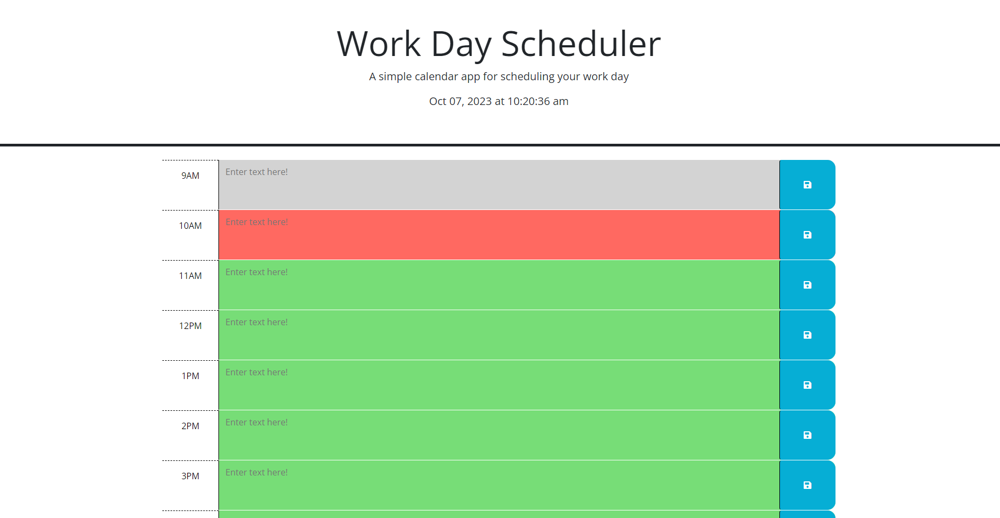
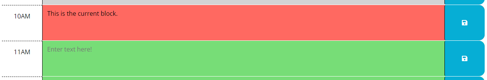
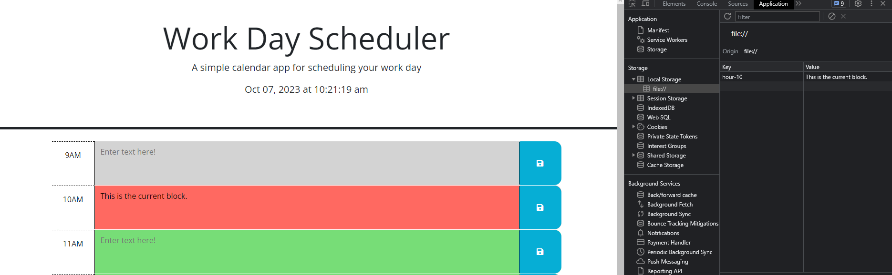
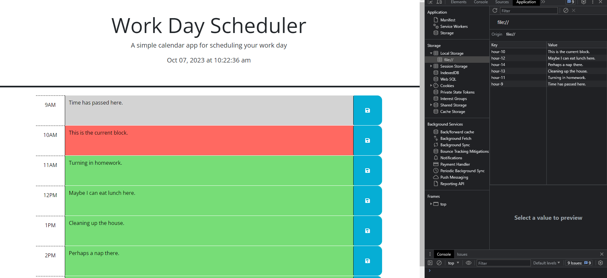
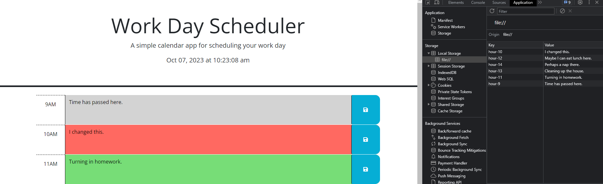

# Challenge-5

## Description
Challenge 5 coursework for UT bootcamp. This challenge is about
being able to allocate information into local storage within a browser,
as well as understand within certain time frames on this work day scheduler,
when the time for an event is past, present, or future, based on the
color scheme.

## Screenshots
---Main page (not designed by me)---

---Entering description into text box---

---Checking local storage---

---Adding more in a random order---

---Replacing text in one box and checking local storage again---

---Refreshing page - info still in local storage---

## Usage
Simply click on the link and watch the magic happen.  
Link to the website: [https://alliestewart.github.io/Work-Day-Scheduler/](https://alliestewart.github.io/Work-Day-Scheduler/)

## What I Have Learned
I've learned a lot about using jQuery to make life easier, as well as how
localStorage works within a browser to store and retrieve input information.

## Credits
Made by Allie Stewart.
I learned a lot of info about jQuery and localStorage from https://developer.mozilla.org/en-US/docs/Web/JavaScript 
and https://www.w3schools.com/js/, as well as helpful
info from the student mini-project from module 5.
Additionally, poked around a lot on https://learn.jquery.com/using-jquery-core/.

## Licenses
Please refer to the LICENSE in the repository.
